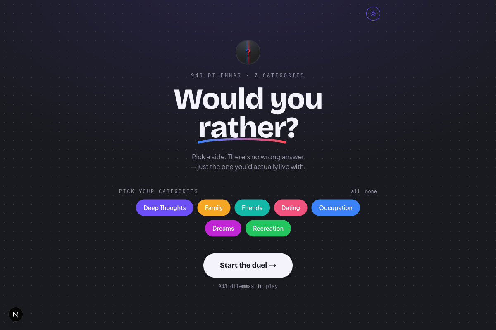
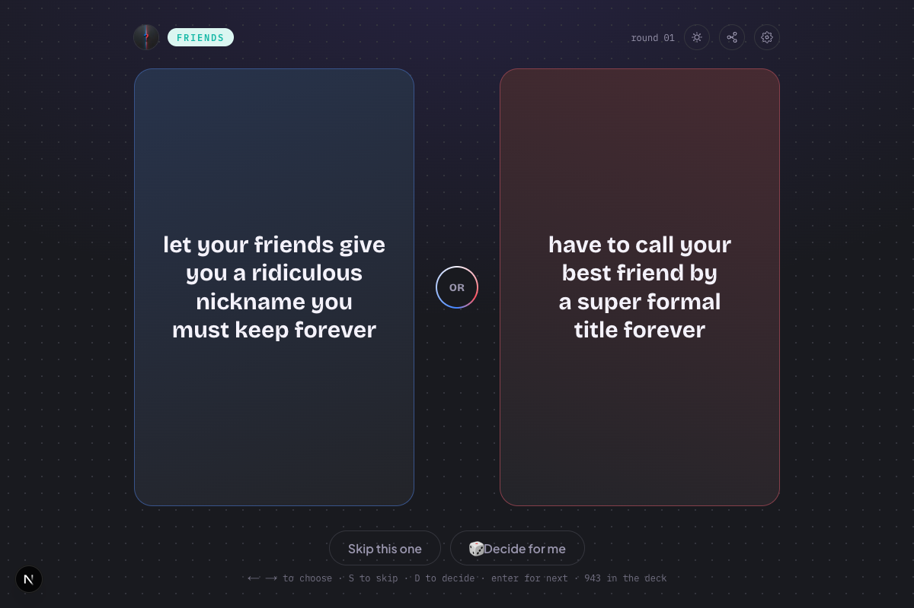
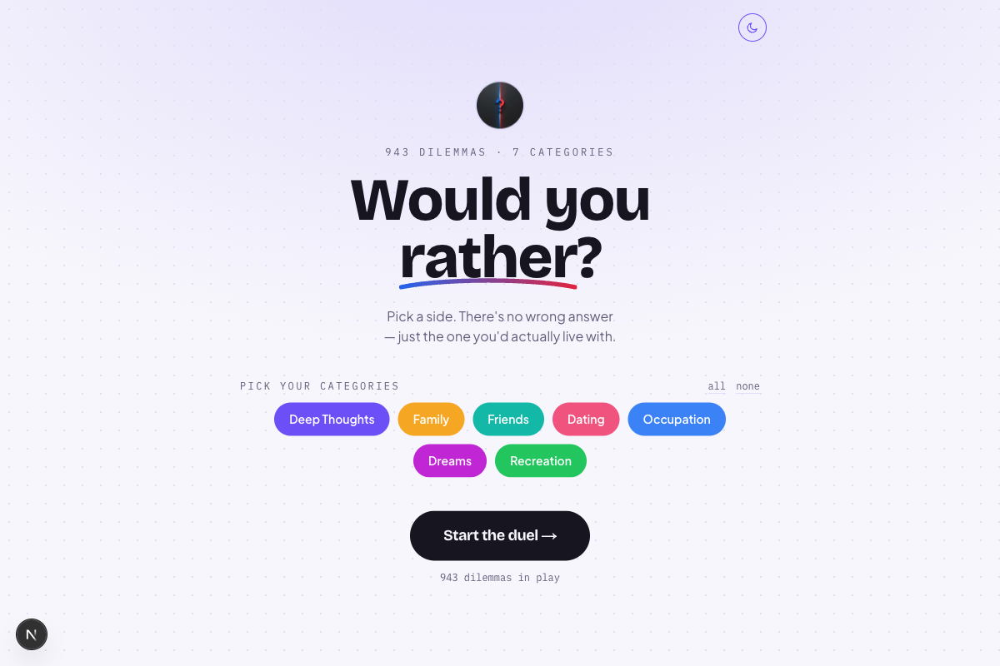
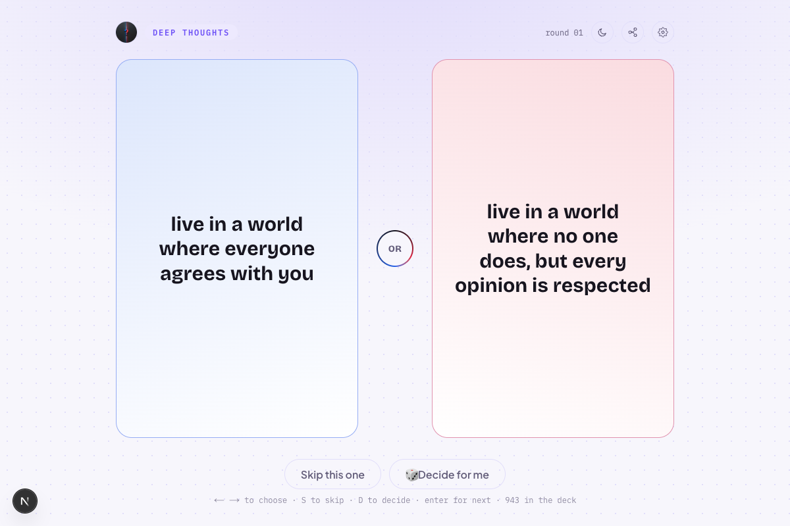

<div align="center">


# Would You Rather

**A party game of impossible choices.**
Pick a side across 7 categories, drawn from 943 curated dilemmas.

[](https://nextjs.org)
[](https://www.typescriptlang.org)
[](https://tailwindcss.com)
[](https://vercel.com/new)

</div>

<br />

<table>
<tr>
<td width="50%"></td>
<td width="50%"></td>
</tr>
<tr>
<td width="50%"></td>
<td width="50%"></td>
</tr>
</table>

## Playing

Pick which categories you want in the deck, hit start, and pick a side. There's
no wrong answer — just the one you'd actually live with.

| Action               | How                                                             |
| -------------------- | ---------------------------------------------------------------- |
| Choose                | Click/tap a panel, or press `←` / `→` (also `1` / `2`)           |
| Skip                  | `S`                                                                |
| Next round            | Automatic, a beat after you pick — `Enter` / `Space` or the countdown ring to hurry it |
| Share a dilemma       | The share icon — sends just the question text, never your pick   |
| Change categories     | The gear icon, any time                                            |
| Light / dark          | The sun/moon icon — dark by default, switch to light for outdoor play |

Nothing about your picks is stored, tracked, or sent anywhere — the app has no
analytics and no backend. The only thing that persists locally is your
light/dark preference.

## The question set

943 dilemmas across 7 categories, each a flat `{ option1, option2, category }`
object in [`data/questions.json`](data/questions.json):

| Category      | Count |
| -------------- | ----: |
| Dating         |   192 |
| Occupation     |   163 |
| Friends        |   162 |
| Deep Thoughts  |   158 |
| Recreation     |   118 |
| Dreams         |    80 |
| Family         |    70 |
| **Total**      | **943** |

The raw source pages each category was gathered and deduplicated from are
kept locally under `data/raw/<category>/` for provenance, but aren't
committed — see [`.gitignore`](.gitignore).

## Tech stack

- **[Next.js](https://nextjs.org)** (App Router) + **TypeScript**
- **[Tailwind CSS v4](https://tailwindcss.com)**, with a hand-tuned design
  token system (`src/app/globals.css`) rather than default theme colors
- Deployed on **[Vercel](https://vercel.com)**

## Getting started

```bash
npm install
npm run dev
```

Open [http://localhost:3000](http://localhost:3000).

## Project structure

```
data/
  questions.json        the full question set (single source of truth)
  raw/<category>/        gathered source pages, kept locally, not committed

src/
  app/
    layout.tsx            fonts, metadata, theme-init script
    page.tsx               root shell
    globals.css             design tokens, dark + light palettes, animations
  components/
    GameApp.tsx             state machine: setup → play
    CategoryPicker.tsx      category selection screen
    DuelStage.tsx            the head-to-head question screen
    OptionPanel.tsx          one side of the duel
    OrBadge.tsx               the center divider
    ThemeToggle.tsx           dark/light switch
  lib/
    data.ts, types.ts, theme.ts, shuffle.ts, share.ts
```

## Deploying

```bash
npx vercel
```

or connect the GitHub repo at [vercel.com/new](https://vercel.com/new).
